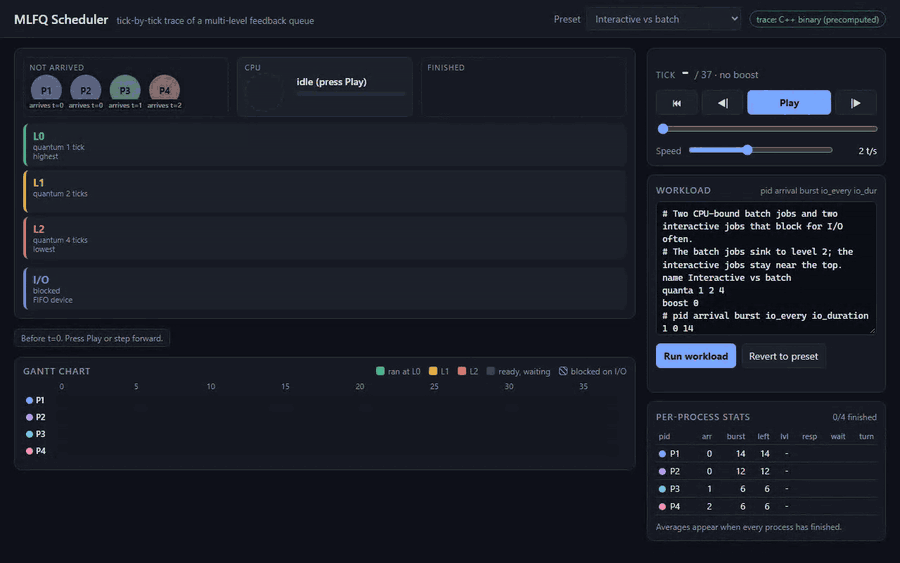
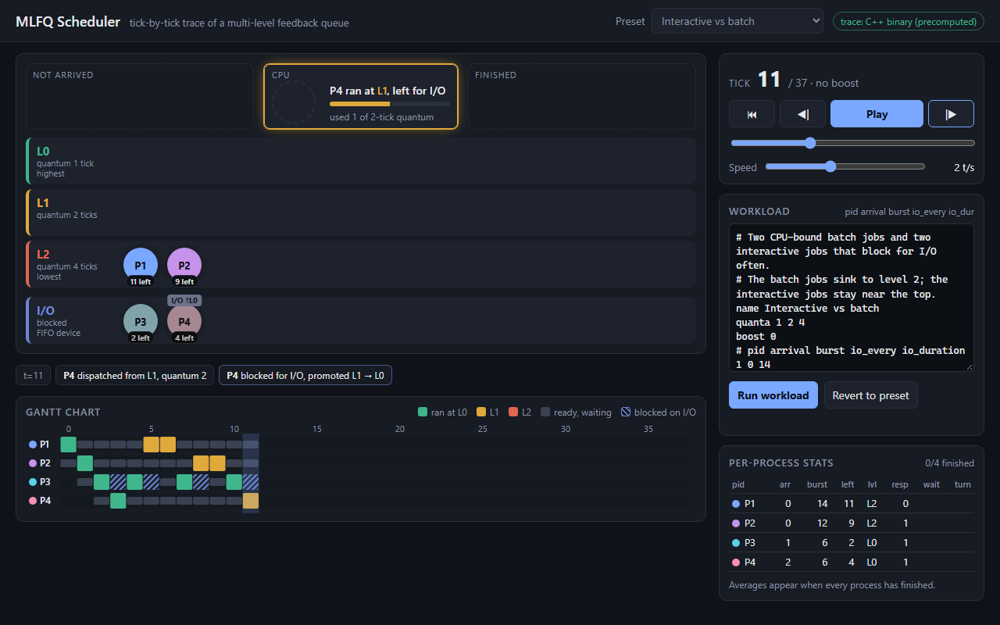
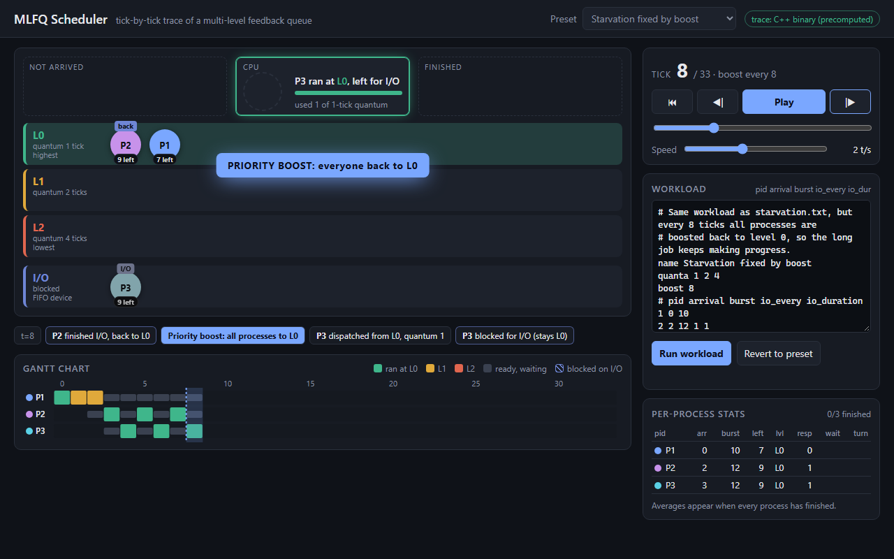
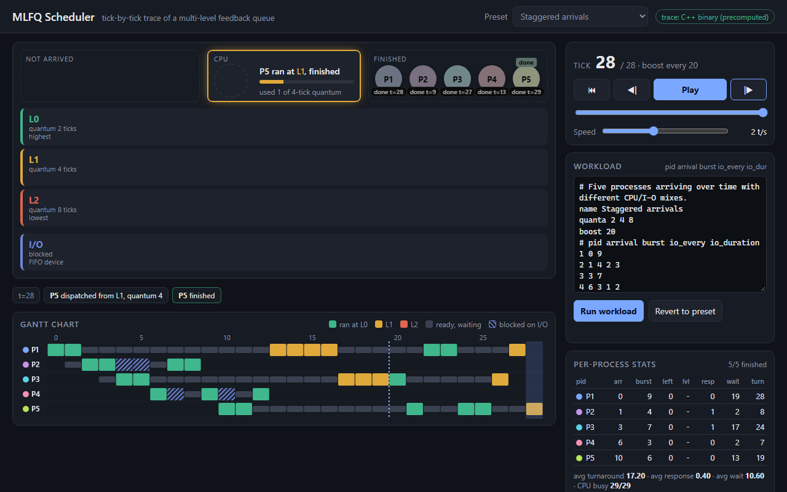
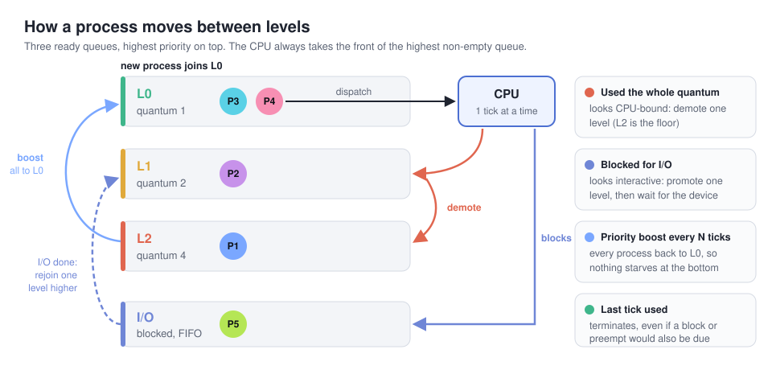
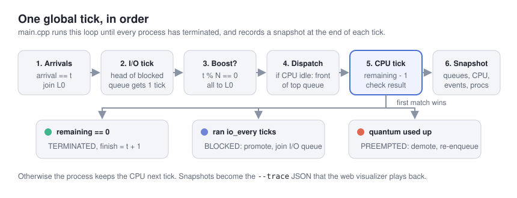
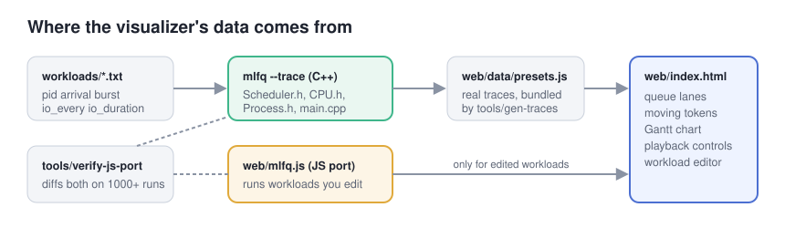
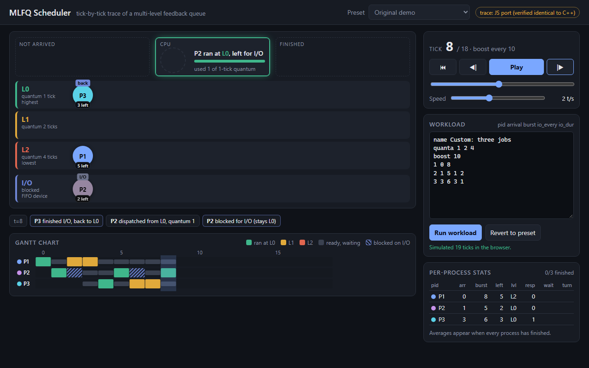

# MLFQ Scheduler

A small C++ simulator of a Multi-Level Feedback Queue CPU scheduler, plus a browser visualizer that replays its tick-by-tick trace.



([MP4 version](docs/media/demo.mp4))

## What it does

The simulator runs a set of processes through a 3-level MLFQ, one global tick at a time. Each process has an arrival time, a CPU burst, and can block for I/O every few ticks of CPU. The scheduler moves processes between levels based on how they behave:

- a process that uses its whole time slice is treated as CPU-bound and demoted,
- a process that gives up the CPU for I/O is treated as interactive and promoted,
- an optional periodic priority boost puts everyone back on the top level so long jobs don't starve.

`mlfq` prints a readable log and a per-process summary (turnaround, response and waiting time). With `--trace` it prints the full scheduler state after every tick as JSON instead. The page in `web/` animates that JSON: process tokens move between queue lanes, the CPU and the I/O queue, a Gantt chart fills in as ticks go by, and you can play, pause, step, scrub and change speed.

| Queues mid-run | Priority boost | Finished run |
|---|---|---|
|  |  |  |

## How it works



Every global tick runs the same six steps, in this order (`main.cpp`):



A few details that follow from that order:

- New arrivals and processes coming back from I/O join their queue before the CPU picks, so they can run on the same tick.
- When a process finishes I/O it rejoins at the level it was promoted to when it blocked.
- The I/O device is a single FIFO: only the head of the blocked queue makes progress, `io_duration` ticks per request.
- A running process is never interrupted by a higher-priority arrival. It keeps the CPU until its quantum ends, it blocks, or it finishes.

### Where the visualizer's data comes from



The presets in the dropdown are real output of the C++ binary. `tools/gen-traces.mjs` runs `mlfq --trace` on every file in `workloads/` and bundles the results into `web/data/presets.js`, so the page works from `file://` with no server.

The browser can't run the C++ code, so for workloads you type into the editor the page uses `web/mlfq.js`, a line-for-line JavaScript port of the scheduler. `tools/verify-js-port.mjs` runs the presets plus 1000 random workloads through both implementations and checks that the traces are identical in every field. The badge in the page header tells you which one produced the trace you're watching.



## Quick start

Build with any C++17 compiler. Both of these were tested on Windows (MSYS2 g++ 15 and Visual Studio 2026):

```sh
# g++ / clang, no build system needed
mkdir -p build
g++ -std=c++17 -O2 -Wall -Wextra -static -o build/mlfq main.cpp CPU.cpp Process.cpp Scheduler.cpp

# or CMake (Visual Studio on Windows, Make/Ninja elsewhere)
cmake -S . -B build
cmake --build build --config Release      # exe ends up in build/ or build/Release/
```

`-static` avoids a Windows problem where the exe loads a different `libstdc++-6.dll` from `PATH` than the one it was built against, which crashes as soon as a file is opened. It's harmless elsewhere. The Visual Studio project `MultiLevelFeedbackQueue.vcxproj` still works too.

Run it:

```sh
./build/mlfq                                   # built-in two-process demo
./build/mlfq --workload workloads/starvation.txt
./build/mlfq --workload workloads/boost.txt --quanta 1,2,8
./build/mlfq --workload workloads/staggered.txt --trace > trace.json
```

Output of the built-in demo:

```
t=  0 | P1@L0 | Q0[2] Q1[1] Q2[] | io[] | P1 arrives; P2 arrives; P1 dispatched q=1; P1 preempted L0->L1;
t=  1 | P2@L0 | Q0[] Q1[1 2] Q2[] | io[] | P2 dispatched q=1; P2 preempted L0->L1;
t=  2 | P1@L1 | Q0[] Q1[2] Q2[] | io[] | P1 dispatched q=2;
t=  3 | P1@L1 | Q0[] Q1[2] Q2[] | io[] | P1 done;
t=  4 | P2@L1 | Q0[] Q1[] Q2[] | io[2] | P2 dispatched q=2; P2 blocks for I/O L1->L0;
t=  5 | P2@L0 | Q0[] Q1[2] Q2[] | io[] | P2 I/O done; P2 dispatched q=1; P2 preempted L0->L1;
t=  6 | P2@L1 | Q0[] Q1[] Q2[] | io[] | P2 dispatched q=2; P2 done;

default: 7 ticks, CPU busy 7/7

 pid  arrive  burst  first  finish  turnaround  response  waiting
   1       0      3      0       4           4         0        1
   2       0      4      1       7           7         1        3

avg turnaround 5.50, avg response 0.50, avg waiting 2.00
```

To use the visualizer, open `web/index.html` in a browser, or serve the folder:

```sh
python -m http.server 8102 --directory web    # then http://localhost:8102
```

Keys: Space play/pause, Left/Right step, Home reset. Adding `?preset=boost` to the URL opens that preset.

After changing the C++ code, regenerate the bundled traces and re-check the JS port (Node 18+, no npm packages):

```sh
node tools/gen-traces.mjs
node tools/verify-js-port.mjs        # prints "1005/1005 workloads identical (...)"
```

### Workload format

```
# comments start with #
name   Interactive vs batch
quanta 1 2 4        # time slice for L0, L1, L2
boost  0            # boost every N ticks, 0 = off
# pid arrival burst [io_every] [io_duration]
1 0 14              # CPU-bound: never blocks
3 1 6 1 2           # blocks after every tick of CPU, 2 ticks of I/O each time
```

`--quanta` and `--boost` on the command line override the file. `--workload -` reads from stdin.

## Project layout

```
Process.h        process state, level, burst and I/O bookkeeping
CPU.h            runs one tick, reports TERMINATED / BLOCKED / PREEMPTED
Scheduler.h      ready queues per level, blocked queue, boost, quanta
Workload.h       workload file parser
Trace.h          per-tick snapshot structs and the JSON writer
main.cpp         CLI, the global tick loop, text log and stats
CMakeLists.txt   CMake build (the .vcxproj is kept for Visual Studio)
workloads/       preset workloads used by the visualizer
web/             index.html, app.js, style.css, mlfq.js (JS port), data/presets.js (generated)
tools/           gen-traces.mjs, verify-js-port.mjs
docs/media/      demo recording, screenshots, diagrams
```

## Design notes and trade-offs

- **Promote on I/O.** Textbook MLFQ (as in OSTEP) keeps a process at the same level when it blocks before its slice runs out. This project promotes it one level instead, which rewards interactive jobs more aggressively. You can see the cost in the *Starvation* preset: two jobs that block every tick hold L0 for 24 ticks straight, and the CPU-bound job at L2 gets nothing until they finish. The *boost* preset is the same workload with a boost every 8 ticks.
- **No gaming protection.** CPU time is not remembered across dispatches, so a job that blocks just before its quantum runs out stays high forever. That's the classic MLFQ loophole; per-level time accounting (OSTEP's revised rule 4) would close it.
- **No preemption by priority.** A new L0 arrival waits for the running process's current slice to end. Slices are short (1, 2, 4 ticks by default), so the effect is small, and it keeps `CPU` and `Scheduler` independent.
- **One I/O device.** Blocked processes are served in FIFO order, one at a time, so I/O is a shared resource you can watch contend, rather than every process sleeping in parallel.
- **Traces are full snapshots, not diffs.** The JSON is bigger (a 38-tick run is about 15 KB), but the page can jump to any tick without replaying from zero, which keeps scrubbing and stepping back simple.
- **Finishing wins.** If a process's last CPU tick is also its I/O tick, it terminates. The original code checked I/O first, so such a process went off to I/O, came back with 0 ticks left and ran to -1. The original `main()` also stopped after a fixed 5 ticks; the loop now runs until every process is done.

## Author

duc-minh-droid
